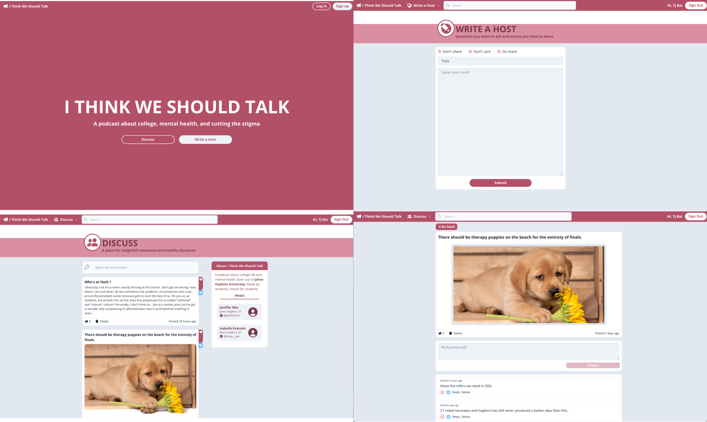

# I Think We Should Talk
Note: This website is still far from done. More of a template/skeleton for future projects or features.

### About _I Think We Should Talk_

A podcast hosted by my 2 great friends, Jen and Izzy, coming Fall 2022.

### Things I learned

- **Basics of Firebase/NoSQL databases**
  - Basic CRUD operations
  - Firebase SDK
- **The beauty of TypeScript**
  - Working with types and interfaces. God bless the autocomplete.
- **More advanced ReactJS concepts**
  - Customs Hooks. Not as scary as I expected. Super useful.
- **Working with NextJS**
  - Dynamic routes and page routing
  - Server-side rendering
  - Wrapping \_app.tsx in a layout
- **Chakra UI**
  - Probably the coolest UI library I've ever used (also the only one)
- **State management with Recoil**
  - Also insanely useful

### Relevant features to add closer to production

- Edit posts and comments
- Add more filtering options
  - Implement time/like-weighted formula
- Update about and ask a host page with pictures
- Track user statistics and liked posts/comments
- Update communityAtom to support more dynamic options
